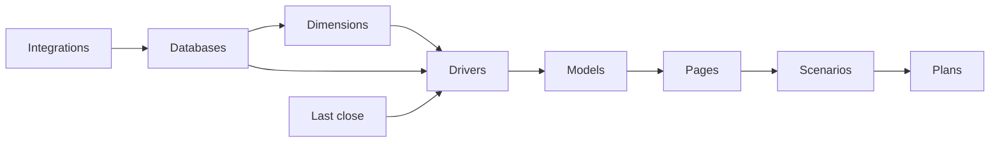

Runway is easiest to learn when you treat it as a flow: data comes in, gets structured, becomes modeled numbers, appears on pages, and can be safely forked into scenarios for planning.

[Integrations](/integrations/intro-to-integrations) bring source data into Runway. Accounting systems, HRIS systems, revenue systems, CSV uploads, sheets, and warehouses are all ways to get business data into the workspace. Integrations write actuals into Runway up to [last close](/concepts/last-close), which is the cutoff between closed historical months and future forecast months.

[Databases](/concepts/databases/databases-basics) are where that source data becomes usable. A database is made of rows of real things: transactions, employees, deals, accounts, vendors, customers, or records you create manually. Some databases come directly from an integration query. Others roll up another database into a cleaner planning grain.

A good database keeps detail available without forcing every report to show that detail. For example, a transaction database can keep every source row, while a rollup database groups those rows by account, department, and month. That lets finance teams inspect the original data when something looks wrong, but model from the summary level that matches the planning decision.

[Dimensions](/concepts/dimensions/dimensions-basics) classify those rows. Department, region, account, entity, employee, and pipeline stage are common dimensions. Dimensions are what let one database support many views of the same data. A transaction can belong to an account and a department; a driver can then be segmented by those dimensions instead of being copied into separate spreadsheet rows.

[Drivers](/concepts/drivers/drivers-basics) are the numbers and dates you model over time. Revenue, headcount, salary expense, cash, contract end date, and quota are drivers. A driver can be unsegmented, or it can be segmented by dimensions so each department, account, or employee has its own time series. Drivers are the values that formulas reference, charts visualize, and plans change.

Segmentation is the bridge between database detail and driver-level planning. One Revenue driver can be segmented by department, region, or account instead of being duplicated for every slice of the business. Formulas can then reference the total driver, a specific segment, or a database-backed input, depending on whether the model needs a company-level number or a detailed operational assumption.

[Models](/concepts/models/models-basics) organize drivers. They are useful when you want a focused working space for a part of the business, such as revenue, headcount, expenses, or cash. [Pages](/concepts/pages/pages-basics) present the model to people: charts, driver tables, database tables, text, images, videos, and plan timelines live on pages.

Models vs. pages can be confusing because they overlap. The honest distinction is that models organize drivers for modeling work, while pages present drivers and context for reporting, collaboration, and repeated workflows. Runway is making these surfaces feel closer together on purpose, so you can move from building to explaining without rebuilding the same content.

[Scenarios](/concepts/scenarios) let you fork the whole world safely. A scenario can change formulas, values, pages, models, databases, and plans without immediately changing Main. That makes scenarios the right place to test a hiring plan, a new budget, or a board-case forecast before deciding what should become official.

[Plans](/concepts/plans) tag changes to initiatives. Instead of hardcoding a value and losing the business reason, you can connect the change to a hiring plan, a product launch, a cost reduction, or another initiative. Plans then show where assumptions live and how they affect the model.

The last key idea is [actuals vs. forecast](/guides/modeling/forecasting-with-closed-actuals). Integrations write actuals through last close. After last close, formulas take over. That boundary lets Runway keep historical months tied to source systems while future months stay editable for planning.

## What's next

- [Quickstart: build your first model](/get-started/quickstart)
- [Databases basics](/concepts/databases/databases-basics)
- [Scenarios](/concepts/scenarios)
